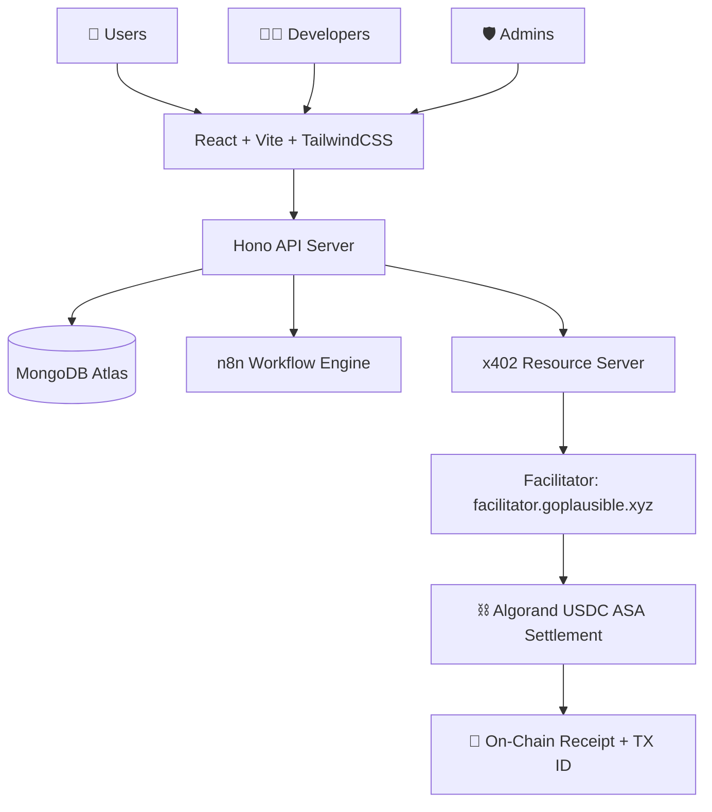
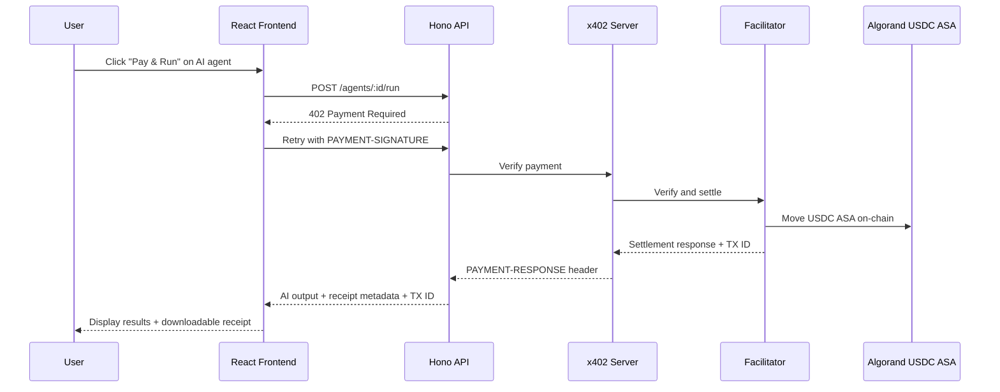

# 🧠💰 CODEMATRI ALGOVERSE — AIHub x402 Marketplace

### *"What if every AI agent on the internet had a price tag — and every payment was a blockchain receipt?"*

---

## 🔥 THE ONE-LINER

> **AIHub is the world's first decentralized, pay-per-use AI agent marketplace — where developers publish AI services, users pay in USDC microtransactions on Algorand, and every single execution gets an on-chain receipt. No subscriptions. No dead seats. Just pure value exchange.**

---

## 😤 THE PROBLEM — WHY This Matters

### The AI industry is broken in 3 ways:

| Problem | Impact |
|:---|:---|
| **💀 Subscription Hell** | Users pay $20-200/month for AI tools they use 3 times. 87% of SaaS seats go unused. That's billions wasted. |
| **🔒 Walled Gardens** | Developers build incredible AI agents but have NO marketplace to monetize them. They're stuck begging for API users on Twitter. |
| **👻 Zero Accountability** | You pay for an AI service, it fails silently, and there's no verifiable proof of what happened. No receipt. No audit trail. Nothing. |

### The bottom line:
> **There is no App Store for AI agents. No place where you pay ONLY when AI delivers value, with cryptographic proof of every transaction.**

**Until now.**

---

## 🚀 THE SOLUTION — What We Built

### AIHub x402 Marketplace

A **full-stack, production-grade AI agent marketplace** that combines:

```
┌─────────────────────────────────────────────────────────────────┐
│                                                                 │
│   🛒 MARKETPLACE      →  Browse, search & filter AI agents     │
│   💳 x402 PAYMENTS    →  HTTP-native micropayments (USDC)      │
│   ⛓️  ALGORAND        →  On-chain settlement & receipts        │
│   🤖 MULTI-LLM ENGINE →  Gemini, OpenAI, Claude, Groq, Ollama │
│   🔧 n8n WORKFLOWS    →  External agent orchestration          │
│   👨‍💻 DEV DASHBOARDS   →  Revenue, analytics, publishing       │
│   🛡️  ADMIN PANEL     →  Moderation, approvals, governance     │
│                                                                 │
└─────────────────────────────────────────────────────────────────┘
```

---

## ⚡ THE MAGIC — How x402 Changes Everything

### What is x402?

**HTTP 402 "Payment Required"** has been a reserved HTTP status code since 1999 — sitting unused for 25+ years. **x402 finally activates it.** It turns any API endpoint into a paywall that machines can negotiate autonomously.

### The Flow (This is the 🤯 moment):

```
   USER                    AIHub API               FACILITATOR            ALGORAND
    │                         │                         │                     │
    │── POST /agents/run ────▶│                         │                     │
    │                         │                         │                     │
    │◀── 402 PAYMENT ────────│                         │                     │
    │    REQUIRED             │                         │                     │
    │                         │                         │                     │
    │── Retry with ──────────▶│                         │                     │
    │   PAYMENT-SIGNATURE     │── Verify ──────────────▶│                     │
    │                         │                         │── Settle USDC ─────▶│
    │                         │                         │◀── TX ID ──────────│
    │                         │◀── PAYMENT-RESPONSE ───│                     │
    │                         │                         │                     │
    │◀── AI Output + ────────│                         │                     │
    │    Receipt + TX ID      │                         │                     │
    │                         │                         │                     │
```

### What this means in plain English:

1. **You ask an AI agent to do something** (summarize text, analyze a resume, generate content)
2. **The server says "that'll be $0.02 in USDC"** — a native HTTP response, not a popup
3. **Your wallet signs the payment** — Pera Wallet on Algorand
4. **The facilitator verifies & settles** — USDC ASA moves on-chain
5. **The AI runs and returns results** — with a downloadable receipt linked to a real Algorand TX ID
6. **The developer gets 90%, marketplace gets 10%** — instantly, on-chain

> 🎯 **From click to AI output to on-chain receipt: under 5 seconds.**

---

## 🏗️ ARCHITECTURE — Built for Scale

### System Overview



### Sequence Diagram — Full Payment Flow



### Tech Stack

| Layer | Technologies |
|:---|:---|
| **Frontend** | React 19, TypeScript, Vite, TailwindCSS, React Router, TanStack Query, Chart.js |
| **Backend** | Hono (ultrafast edge-ready framework), Node.js, TypeScript, Zod validation |
| **Database** | MongoDB with Mongoose ODM |
| **Payments** | x402 Protocol (`@x402/core`, `@x402/hono`, `@x402/fetch`, `@x402/avm`) |
| **Blockchain** | Algorand (Testnet/Mainnet), USDC ASA, Pera Wallet |
| **AI Providers** | Google Gemini ⭐, OpenAI, Anthropic Claude, Groq, Ollama (local) |
| **Orchestration** | n8n (webhook-based agent workflow engine) |
| **Deployment** | Vercel (frontend), Render (API), MongoDB Atlas (DB), Docker Compose |
| **Shared Package** | Monorepo (`packages/shared`) — types, schemas, constants across frontend & backend |

---

## 🤖 MULTI-LLM DYNAMIC AGENT ENGINE

This is not a wrapper around one API. **Every agent can use a different AI provider and model.**

### Supported Providers & Models

| Provider | Models | Use Case |
|:---|:---|:---|
| **Google Gemini** ⭐ | `gemini-2.0-flash`, `gemini-1.5-pro`, `gemini-1.5-flash` | Default, fast, cost-effective |
| **OpenAI** | `gpt-4o`, `gpt-4o-mini`, `gpt-3.5-turbo` | Premium reasoning tasks |
| **Anthropic Claude** | `claude-3-5-sonnet`, `claude-3-opus`, `claude-3-5-haiku` | Long-context, nuanced analysis |
| **Groq** | `llama-3.3-70b`, `llama-3.1-8b`, `mixtral-8x7b` | Blazing-fast open-source inference |
| **Ollama** | `llama3.1`, `mistral`, `gemma2` | Fully local, zero-cost, private |

### Dynamic Agent Configuration

Each agent published on the marketplace carries a full config:

```typescript
interface AgentConfig {
  ai: {
    provider: "gemini" | "openai" | "claude" | "groq" | "ollama";
    model: string;
    temperature: number;        // Creativity control
    maxTokens: number;          // Output length limit
    systemPrompt: string;       // Agent persona & instructions
    responseFormat: "text" | "json";
  };
  pricing: {
    currency: "USDC";
    pricePerRequest: number;    // e.g., $0.02
    freeTrial: boolean;
    freeTrialRequests?: number;
    rateLimitPerMinute?: number;
  };
  input: { text, pdf, image, audio, json };   // What the agent accepts
  output: { markdown, json, text, pdf, image }; // What the agent returns
  tools: AgentToolConfig[];     // Web search, OCR, calculator, etc.
  n8nWorkflowId?: string;       // External n8n workflow binding
  n8nWebhookUrl?: string;       // Direct n8n webhook URL
}
```

### 14 Built-In Agent Tools

| Tool | What It Does |
|:---|:---|
| 🔍 Web Search | Search the web and return relevant results |
| 🧮 Calculator | Arithmetic and scientific calculations |
| 📄 PDF Reader | Extract and parse text from PDFs |
| 👁️ OCR | Extract text from images |
| 🗄️ Database | Query structured database records |
| 🔤 SQL | Natural language to SQL translation |
| 📁 File Storage | Store and retrieve workspace files |
| 🎨 Image Generation | Generate images from prompts |
| ✉️ Email | Compose and send emails |
| 🌤️ Weather | Current weather and forecasts |
| 🐙 GitHub | Read repos, issues, and PRs |
| 📂 Google Drive | Read/write Google Drive files |
| 📅 Calendar | Read/schedule calendar events |
| 💻 Code Execution | Run code in a sandboxed environment |

---

## 🔧 n8n WORKFLOW INTEGRATION — Agents Beyond Simple Prompts

Most AI marketplaces stop at "send prompt → get text back." **We go further.**

Any AIHub agent can be wired to an **n8n workflow** — enabling multi-step pipelines, external API calls, branching logic, retries, and async processing.

### How It Works

```
AIHub Marketplace                         n8n Workflow Engine
┌──────────────────┐                    ┌──────────────────────┐
│                  │                    │                      │
│  User pays $0.02 │─── Webhook POST ─▶│  Validate & Parse    │
│  via x402        │                    │       ↓              │
│                  │                    │  Call External APIs   │
│                  │                    │       ↓              │
│  Store receipt   │◀── JSON Response ─│  Transform Output    │
│  + TX ID         │                    │       ↓              │
│                  │                    │  Respond to Webhook  │
└──────────────────┘                    └──────────────────────┘
```

### Included Sample Workflow: Warimitra Text Summarizer

A production-ready n8n workflow that:
- Receives text via webhook
- Extracts key sentences using algorithmic summarization
- Calculates compression ratio
- Returns structured JSON with summary, key takeaways, word counts, and sentiment

### Real-World Agent Pipelines Possible

| Agent Type | n8n Workflow |
|:---|:---|
| 🔬 Research Agent | Web scraping → summarization → source cleanup |
| 📄 Resume Analyzer | File parsing → scoring → feedback generation |
| 🎧 Customer Support | Ticket lookup → response drafting → CRM updates |
| ✍️ Content Agent | Prompt enrichment → image generation → publishing |

---

## 📊 COMPLETE PLATFORM FEATURES

### For Users

| Feature | Description |
|:---|:---|
| 🛒 **Marketplace** | Browse, search, filter agents by category |
| 🔍 **Agent Details** | Full pricing, documentation, execution flow, reviews |
| 💳 **Pay & Run** | One-click execution with USDC micropayment |
| 👛 **Pera Wallet** | Native Algorand wallet integration |
| 📜 **History** | Full execution history with downloadable receipts |
| 💰 **Payments** | Transaction log with Algorand TX IDs |
| ⚙️ **Settings** | Profile, preferences, wallet management |

### For Developers

| Feature | Description |
|:---|:---|
| 📤 **Agent Publishing** | Publish AI agents with custom config |
| 💵 **Revenue Dashboard** | Track earnings (90% developer share!) |
| 📈 **Analytics** | Usage metrics, trending data, API calls |
| 🔄 **Versioning** | Agent versions with changelogs |
| 🔗 **n8n Integration** | Wire agents to external workflow engines |
| ⭐ **Reviews & Ratings** | Community feedback system |

### For Admins

| Feature | Description |
|:---|:---|
| ✅ **Approvals** | Review and approve/reject agent submissions |
| 🚫 **Moderation** | Ban agents or developers |
| 🌟 **Featuring** | Spotlight trending agents |
| 📊 **Platform Analytics** | Revenue, users, transactions, approval rates |
| 🏷️ **Category Management** | Manage marketplace taxonomy |

---

## 💰 BUSINESS MODEL — Simple & Sustainable

```
┌──────────────────────────────────────────────────────────┐
│                                                          │
│    User pays $0.02 per AI agent execution (USDC)         │
│                                                          │
│    ┌──────────────────┐    ┌──────────────────────────┐  │
│    │                  │    │                          │  │
│    │  DEVELOPER: 90%  │    │  MARKETPLACE: 10%        │  │
│    │  = $0.018        │    │  = $0.002                │  │
│    │                  │    │                          │  │
│    └──────────────────┘    └──────────────────────────┘  │
│                                                          │
│    Settlement: Algorand USDC ASA (near-zero gas fees)    │
│    Receipt: On-chain, verifiable, downloadable           │
│                                                          │
└──────────────────────────────────────────────────────────┘
```

### Why This Crushes Subscriptions:

| Metric | Subscription Model | AIHub Pay-Per-Use |
|:---|:---|:---|
| **Cost to try** | $20/month minimum | $0.02 per use |
| **Unused spend** | 87% avg waste | $0.00 waste |
| **Developer payout** | 30-70% after months | 90% instant |
| **Payment proof** | Email receipt (maybe) | Algorand TX ID |
| **Lock-in** | Annual contracts | Zero commitment |

---

## 🛡️ SECURITY & TRUST

| Layer | Implementation |
|:---|:---|
| **Authentication** | JWT access + refresh tokens with bcrypt password hashing |
| **Payment Security** | x402 HMAC-signed payload verification |
| **n8n Security** | Shared secret headers between AIHub ↔ n8n |
| **Wallet Verification** | Pera Wallet address verified on-chain |
| **Rate Limiting** | Per-route rate limits (20/min auth, 100/min agents) |
| **CORS** | Strict origin whitelisting |
| **Security Headers** | Full security headers middleware |
| **Receipt Integrity** | Every receipt links to a verifiable Algorand TX ID |
| **Settlement Audit** | Failed/cancelled settlements tracked in MongoDB |

---

## 🎬 LIVE DEMO FLOW — What We'll Show You

### Step 1: Browse the Marketplace
> Open the landing page → see featured agents, live metrics, and the x402 payment flow visualization

### Step 2: Select an Agent
> Click "Resume Analyzer" ($0.02 USDC) → see pricing, tags, documentation, and input schema

### Step 3: Execute with Payment
> Enter input → click "Pay & Run" → watch the live payment state machine:
>
> `IDLE → PAYMENT_REQUIRED → WALLET_OPEN → SIGNING → SUBMITTING → VERIFYING → PAID → EXECUTING → COMPLETED`

### Step 4: View Results
> See structured AI output with key takeaways, scores, and recommendations

### Step 5: Verify On-Chain
> Check the Algorand transaction ID → view the receipt → download the proof of payment

### Step 6: Developer Dashboard
> Switch to developer view → see revenue analytics, agent performance, and payout history

### 🎨 Demo Mode
> The entire platform works **without any external dependencies** using `DEMO_MODE=true`. No MongoDB, no wallet, no API keys needed — perfect for presentations and judging.

---

## 🏛️ PROJECT STRUCTURE

```
CODEMATRI_ALGOVERSE/
│
├── apps/
│   ├── web/                    # React 19 + Vite + TailwindCSS frontend
│   │   └── src/
│   │       ├── pages/          # 14 full pages (Home, Marketplace, Agent Details,
│   │       │                   #   Developer Dashboard, Admin Dashboard, Wallet,
│   │       │                   #   Payments, History, Analytics, Auth, Profile,
│   │       │                   #   Settings, User Dashboard, Agent Builder)
│   │       ├── components/     # Reusable UI components + structured output viewer
│   │       ├── lib/            # API client, agent runner, Pera wallet signer
│   │       └── data/           # Mock data for demo mode
│   │
│   └── api/                    # Hono + Node.js backend
│       └── src/
│           ├── routes/         # Auth, Agents, Developer, Admin, Payments,
│           │                   #   Execution, Dashboard, Health
│           ├── services/       # Agent, Auth, Analytics, Payment, Receipt,
│           │                   #   Execution, n8n, Dashboard, Seed
│           ├── models/         # User, Agent, Transaction, Receipt, Review,
│           │                   #   Favorite, UsageLog, Analytics, AgentVersion,
│           │                   #   AgentTool, ExecutionLog
│           ├── middleware/     # Settlement, Error, Rate Limit, Security Headers
│           ├── lib/            # LLM client, Agent definitions, Demo store,
│           │                   #   JWT, x402 payment utils
│           └── x402/           # x402 resource server, dynamic routes, server
│
├── packages/
│   └── shared/                 # Monorepo shared code
│       └── src/
│           ├── types.ts        # 30+ TypeScript interfaces (full type safety)
│           ├── schemas.ts      # Zod validation schemas
│           └── constants.ts    # AI providers, tools, categories, sample agents
│
├── n8n-workflows/              # Exportable n8n workflow definitions
│   └── warimitra_text_summarizer_n8n_workflow.json
│
├── docs/                       # 12 documentation files + OpenAPI spec
│   ├── 01-architecture.md      #   (with Mermaid diagrams)
│   ├── 07-payment-layer.md
│   ├── 11-n8n-integration.md
│   └── openapi.yaml
│
├── docker-compose.yml          # One-command full-stack deployment
├── render.yaml                 # Render.com deployment config
├── vercel.json                 # Vercel deployment config
└── DEPLOYMENT.md               # Step-by-step deployment guide
```

---

## 📐 WHAT MAKES THIS DIFFERENT

### vs. ChatGPT / Claude subscriptions
> ❌ They charge $20/month even if you use it once  
> ✅ **We charge $0.02 per use with blockchain proof**

### vs. Hugging Face / Replicate
> ❌ They're model hosting, not a marketplace with payments  
> ✅ **We're a full marketplace with x402 micropayments, developer revenue, and admin moderation**

### vs. Other Web3 AI projects
> ❌ They bolt crypto onto AI with no real utility  
> ✅ **We use x402 as a native HTTP payment protocol — the blockchain IS the payment rail, not a gimmick**

### vs. Traditional API marketplaces (RapidAPI)
> ❌ They use credit cards, monthly billing, no on-chain receipts  
> ✅ **We settle instantly in USDC on Algorand with verifiable transaction IDs**

---

## 🌍 MARKET OPPORTUNITY

| Metric | Value |
|:---|:---|
| **Global AI Market (2026)** | $500B+ |
| **API Economy** | $6.2T by 2028 |
| **SaaS Waste** | $40B/year in unused subscriptions |
| **Algorand DeFi TVL** | Growing ecosystem with near-zero fees |
| **x402 Protocol** | First-mover advantage in HTTP-native payments |

### Target Users

1. **Individual users** — Pay $0.02 instead of $20/month for occasional AI use
2. **Developers** — Monetize AI agents instantly, keep 90% of revenue
3. **Enterprises** — Verifiable AI spending with on-chain audit trails
4. **AI researchers** — Monetize specialized models without building infrastructure

---

## 🗺️ ROADMAP

| Phase | Status | Deliverables |
|:---|:---|:---|
| **Phase A** — Shared Contracts | ✅ Done | Types, schemas, constants |
| **Phase B** — Database Models | ✅ Done | 11 Mongoose models |
| **Phase C** — Dynamic Agent Engine | ✅ Done | 5 LLM providers, tool registry |
| **Phase D** — Service Layer | ✅ Done | 11 services (agent, auth, payment, n8n, etc.) |
| **Phase E** — API Routes | 🔨 In Progress | REST endpoints for all features |
| **Phase F** — Dynamic x402 | 📋 Next | Per-agent dynamic payment routes |
| **Phase G** — Full UI | 📋 Next | Agent builder, advanced dashboards |
| **Phase H** — Agent-to-Agent | 🔮 Future | AI agents paying other AI agents autonomously |

### 🤯 The Vision: Agent-to-Agent Payments

The **autonomous payment module** (`autonomous-payment.ts`) already exists in the codebase. It enables a backend-owned wallet to sign x402 payments programmatically — meaning **AI agents can pay other AI agents** without human intervention.

> Imagine: A research agent pays $0.02 to a summarizer agent, which pays $0.01 to a translation agent — all settled on Algorand, all with receipts, all autonomous.

**This is the future of the AI economy. And we're building the rails.**

---

## 👥 TEAM — CODEMATRI

We are **CODEMATRI** — a team of builders obsessed with the intersection of AI, blockchain, and developer economics.

- **Full-stack TypeScript monorepo** — 30+ files, 320+ types, production-grade
- **12 documentation files** — architecture, API design, payment layer, deployment, testing
- **Docker Compose + Render + Vercel** — deploy anywhere in minutes
- **Demo mode** — works offline with zero dependencies for judging

---

## 🏁 TL;DR — Why We Should Win

| Criteria | Our Answer |
|:---|:---|
| **Innovation** | First x402 HTTP-native AI marketplace on Algorand |
| **Technical Depth** | 5 LLM providers, n8n orchestration, dynamic x402, autonomous payments |
| **Completeness** | Full marketplace + developer dashboard + admin panel + wallet + analytics |
| **Blockchain Integration** | Not a gimmick — x402 IS the payment protocol, Algorand IS the settlement layer |
| **Business Viability** | Pay-per-use disrupts $40B in SaaS waste |
| **Demo Ready** | Works out of the box with `npm run dev` |
| **Scalability** | Monorepo, Docker, edge-ready Hono backend, MongoDB Atlas |
| **Documentation** | 12 docs, OpenAPI spec, deployment guide, n8n integration guide |

---

> ### 💬 *"We didn't just build another AI wrapper. We built the financial infrastructure for the entire AI agent economy — where every computation has a price, every payment is instant, and every receipt lives on-chain forever."*

---

**🔗 Repository:** CODEMATRI_ALGOVERSE  
**⛓️ Network:** Algorand Testnet  
**💰 Currency:** USDC ASA  
**🌐 Protocol:** x402 (HTTP 402 Payment Required)  
**🚀 Deploy:** `npm run dev` → Open `http://localhost:5173`

---

*Built with 🔥 by Team CODEMATRI for the Algorand hackathon*
