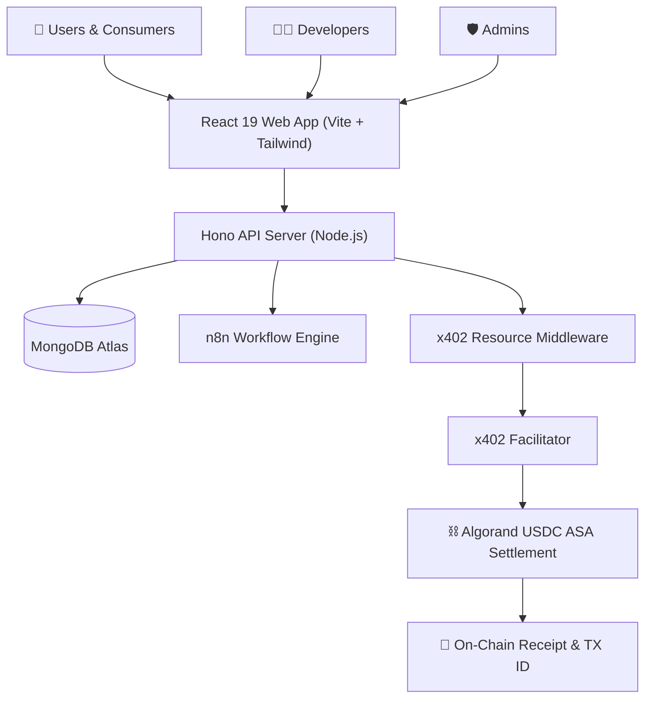
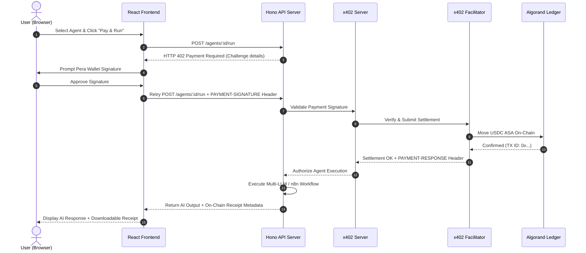

# 🚀 Codematrix_Algoverse — AIHub x402 Marketplace

[](https://www.typescriptlang.org/)
[](https://react.dev/)
[](https://hono.dev/)
[](https://www.algorand.com/)
[](https://x402.org)
[](https://vitejs.dev/)
[](https://tailwindcss.com/)
[](./LICENSE)

> **Codematrix_Algoverse (AIHub)** is a decentralized, pay-per-use AI agent marketplace built on **Algorand** and the **x402 (HTTP 402 Payment Required)** protocol. Developers publish autonomous AI services, users execute agents with instant USDC microtransactions via **Pera Wallet**, and every execution generates a cryptographically verifiable on-chain receipt.

---

## 📑 Table of Contents

- [✨ Overview](#-overview)
- [🔥 Key Features](#-key-features)
- [🏗️ System Architecture](#️-system-architecture)
- [💳 How the x402 Payment Flow Works](#-how-the-x402-payment-flow-works)
- [🛠️ Tech Stack](#️-tech-stack)
- [📁 Project Structure](#-project-structure)
- [🚀 Quick Start Guide](#-quick-start-guide)
- [⚡ Dual Execution Modes](#-dual-execution-modes)
- [🔑 Environment Variables](#-environment-variables)
- [🔌 API Endpoints](#-api-endpoints)
- [🔄 n8n Agent Workflow Integration](#-n8n-agent-workflow-integration)
- [🧪 Testing & Verification](#-testing--verification)
- [☁️ Deployment Guide](#️-deployment-guide)
- [🤝 Contributing](#-contributing)
- [📄 License](#-license)

---

## ✨ Overview

The traditional AI software ecosystem suffers from three core bottlenecks:
1. **Subscription Inefficiency:** Users pay high monthly fees ($20–$200/mo) for AI tools they use infrequently.
2. **Monetization Barriers for Developers:** Developers create specialized AI agents but lack a frictionless payment rail to monetize individual API calls.
3. **Lack of Auditability:** Traditional platforms provide no verifiable proof of execution or itemized on-chain receipts.

**Codematrix_Algoverse** solves this by leveraging **HTTP 402 Payment Required** (`x402`) and **Algorand micro-settlements**. Users pay per execution (e.g., $0.02 USDC), wallets sign transactions natively in the browser, and the platform issues an on-chain transaction receipt tied to the Algorand blockchain.

---

## 🔥 Key Features

- **🛒 AI Agent Marketplace:** Browse, filter, and search AI agents by category, pricing, tags, and rating.
- **💳 x402 HTTP Paywall:** Native HTTP 402 protocol integration that negotiates payments directly over standard API headers.
- **👛 Pera Wallet Integration:** Seamless web3 browser wallet connection for Algorand signers.
- **⛓️ Algorand On-Chain Settlement:** Fast, low-fee micro-transactions using USDC ASA on Algorand testnet and mainnet.
- **🧾 Cryptographic Receipts:** Automated PDF/JSON execution receipts featuring Algorand Transaction IDs.
- **🤖 Multi-LLM Execution Engine:** Native support for Google Gemini, OpenAI GPT, Anthropic Claude, Groq, and local Ollama models.
- **🔌 n8n Workflow Integration:** Capability to trigger external automated agent workflows hosted on n8n.
- **👨‍💻 Developer Dashboard:** Manage published agents, track usage metrics, view real-time earnings, and set pricing.
- **🛡️ Admin Moderation Panel:** Review pending agent submissions, manage users, monitor transaction flows, and adjust system settings.
- **⚡ Zero-Config Demo Mode:** Ships with an in-memory mock fallback mode (`DEMO_MODE=true`), enabling immediate testing without requiring MongoDB or blockchain setup.

---

## 🏗️ System Architecture

### High-Level Component Overview



### End-to-End Payment Sequence Diagram



---

## 💳 How the x402 Payment Flow Works

1. **Agent Call:** The user initiates an execution request for a paid AI agent.
2. **HTTP 402 Challenge:** The API intercepts the request and responds with status `402 Payment Required` and challenge details (amount in USDC, recipient Algorand address, network).
3. **Client Signing:** The frontend uses `@perawallet/connect` and `@x402/avm` to sign the transaction.
4. **Header Verification:** The request is retried with the signed payload in the `PAYMENT-SIGNATURE` HTTP header.
5. **On-Chain Settlement:** The x402 facilitator verifies the signature and submits the USDC ASA transaction to the Algorand blockchain.
6. **Execution & Receipt:** Upon settlement confirmation, the backend executes the agent logic and attaches the Algorand Transaction ID to the generated receipt.

---

## 🛠️ Tech Stack

| Layer | Technology | Description |
|:---|:---|:---|
| **Frontend** | React 19, Vite 6, TypeScript 5.8 | Modern SPA framework with fast HMR |
| **Styling** | Tailwind CSS 3.4, Lucide Icons | Responsive UI design system |
| **State Management** | TanStack Query v5, React Router v7 | Server state caching and routing |
| **Backend** | Hono v4, Node.js | Edge-ready, high-performance web framework |
| **Payments** | `@x402/core`, `@x402/hono`, `@x402/avm` | HTTP 402 paywall protocol SDKs |
| **Blockchain** | Algorand (Testnet/Mainnet), Pera Wallet | Layer 1 blockchain and web wallet connector |
| **Database** | MongoDB Atlas, Mongoose 8 | Document database for persistent storage |
| **AI Providers** | Google Gemini, OpenAI, Claude, Ollama | Multi-provider LLM runtime engine |
| **Orchestration** | n8n Workflows | Webhook-driven complex agent pipelines |
| **Build Tools** | Prettier, Vitest, npm workspaces | Monorepo toolchain management |

---

## 📁 Project Structure

```
CODEMATRI_ALGOVERSE/
├── apps/
│   ├── api/                     # Backend API server (Hono)
│   │   ├── src/
│   │   │   ├── middleware/      # Auth & x402 payment middlewares
│   │   │   ├── routes/          # API route definitions
│   │   │   ├── services/        # LLM execution & business logic
│   │   │   ├── models/          # MongoDB Mongoose schemas
│   │   │   └── scripts/         # Database seed scripts
│   │   └── tsconfig.json
│   │
│   └── web/                     # Frontend client app (React + Vite)
│       ├── src/
│       │   ├── components/      # UI components & layout shell
│       │   ├── pages/           # Marketplace, Dashboard, Wallet pages
│       │   ├── services/        # API client & Pera Wallet connector
│       │   └── types/           # Client-side TypeScript interfaces
│       └── vite.config.ts
│
├── packages/
│   └── shared/                  # Shared domain package
│       ├── src/                 # Constants, Zod schemas, and types
│       └── package.json
│
├── docs/                        # Complete technical documentation index
│   ├── 01-architecture.md
│   ├── 03-database.md
│   ├── 07-payment-layer.md
│   ├── 11-n8n-integration.md
│   └── README.md
│
├── n8n-workflows/               # Sample n8n workflow definitions
│   └── resume-analyzer.json
│
├── .env.example                 # Environment template file
├── docker-compose.yml           # Docker orchestration
├── render.yaml                  # Render deployment configuration
├── vercel.json                  # Vercel deployment configuration
├── package.json                 # Monorepo root workspaces configuration
├── CONTRIBUTING.md              # Open-source contribution guidelines
└── LICENSE                      # MIT Open-Source License
```

---

## 🚀 Quick Start Guide

### Prerequisites

- **Node.js:** v18.0.0 or higher
- **npm:** v9.0.0 or higher
- **Pera Wallet:** Browser extension or mobile app (for wallet testing)

### Step-by-step Installation

1. **Clone the Repository:**
   ```bash
   git clone https://github.com/harsh080705/Codematrix_Algoverse.git
   cd CODEMATRI_ALGOVERSE
   ```

2. **Install Workspace Dependencies:**
   ```bash
   npm install
   ```

3. **Configure Environment File:**
   ```bash
   cp .env.example .env
   ```
   *(By default, `DEMO_MODE=true` is enabled, allowing you to run the application immediately without database or API key requirements).*

4. **Start Development Server:**
   ```bash
   npm run dev
   ```

5. **Access Application:**
   - **Frontend App:** [`http://localhost:5173`](http://localhost:5173)
   - **Backend API:** [`http://localhost:8080`](http://localhost:8080)
   - **API Health Check:** [`http://localhost:8080/health`](http://localhost:8080/health)

---

## ⚡ Dual Execution Modes

Codematrix_Algoverse supports two execution modes:

### 1. Demo Mode (`DEMO_MODE=true` — Default)
- **Zero Infrastructure:** Operates without requiring MongoDB, x402 facilitator services, or API key configuration.
- **In-Memory Store:** Auth sessions, agent listings, demo execution responses, and sample transaction receipts are managed in memory.
- **Ideal For:** Hackathon live presentations, UI walkthroughs, and local front-end development.

### 2. Production Mode (`DEMO_MODE=false`)
- **Full Storage & Blockchain:** Connects to a real MongoDB Atlas instance and Algorand Testnet/Mainnet via the x402 facilitator.
- **Real LLM Output:** Executes agent requests using Google Gemini API (`GEMINI_API_KEY`) or OpenAI fallback (`OPENAI_API_KEY`).
- **Real USDC Settlement:** Collects actual micro-payments and issues verified Algorand TX IDs on-chain.

---

## 🔑 Environment Variables

Key configuration variables stored in `.env`:

| Variable Name | Default | Description |
|:---|:---|:---|
| `PORT` | `8080` | Port for Hono API server |
| `DEMO_MODE` | `true` | Enable mock in-memory mode (`true`/`false`) |
| `MONGODB_URI` | `""` | MongoDB Atlas connection string |
| `JWT_SECRET` | `secret` | Secret key for signing JWT tokens |
| `ENABLE_X402` | `false` | Enable x402 payment validation middleware |
| `X402_FACILITATOR_URL` | `https://...` | x402 payment settlement facilitator URL |
| `X402_NETWORK` | `algorand:testnet` | Target blockchain network (`algorand:testnet` / `algorand:mainnet`) |
| `X402_PAY_TO` | `""` | Algorand payout wallet address for platform fees |
| `X402_ASSET` | `USDC` | Settlement token asset |
| `GEMINI_API_KEY` | `""` | Google Gemini API key for AI execution |
| `OPENAI_API_KEY` | `""` | Optional OpenAI API fallback key |
| `CORS_ORIGIN` | `http://localhost:5173` | Allowed CORS frontend origin |

*For complete configuration options, consult [`.env.example`](./.env.example).*

---

## 🔌 API Endpoints

### Public & Health
- `GET /health` — Check backend operational status and service timestamp.

### Authentication (`/auth`)
- `POST /auth/register` — Create a new user or developer account.
- `POST /auth/login` — Sign in and obtain JWT access tokens.
- `POST /auth/wallet-login` — Sign in using a connected Pera Wallet address.

### Marketplace Agents (`/agents`)
- `GET /agents` — Fetch approved agents with search, category filter, and pagination.
- `GET /agents/:id` — Retrieve detailed agent metadata, pricing, and execution parameters.
- `POST /agents/:id/run` — **Protected x402 endpoint:** Execute AI agent (requires valid payment signature).

### Developer Dashboard (`/developer`)
- `GET /developer/agents` — List agents created by the authenticated developer.
- `POST /developer/agents` — Publish a new AI agent to the marketplace.
- `GET /developer/analytics` — View agent invocation counts, revenue summaries, and rating metrics.

### Admin Governance (`/admin`)
- `GET /admin/pending-agents` — Review submitted agents awaiting moderation.
- `PATCH /admin/agents/:id/status` — Approve or reject an agent submission.

---

## 🔄 n8n Agent Workflow Integration

Codematrix_Algoverse can trigger multi-step external workflows hosted on **n8n**. 

1. Export an n8n JSON workflow (e.g., [`n8n-workflows/resume-analyzer.json`](./n8n-workflows/resume-analyzer.json)).
2. Register an agent on the marketplace with `executionType: "n8n"` and point the `endpoint` URL to your active n8n webhook.
3. When a user completes the x402 payment, Codematrix_Algoverse securely relays the payload to n8n and returns the workflow result to the user.

*(See [`docs/11-n8n-integration.md`](./docs/11-n8n-integration.md) for step-by-step n8n setup instructions).*

---

## 🧪 Testing & Verification

Run tests and type safety checks across the workspace:

```bash
# Type check all packages (shared, api, web)
npm run typecheck

# Run unit tests
npm run test

# Build production artifacts
npm run build

# Format codebase with Prettier
npm run format
```

---

## ☁️ Deployment Guide

Recommended production hosting architecture:

- **Frontend (`apps/web`):** Vercel / Netlify (`npm run build --workspace apps/web`)
- **Backend (`apps/api`):** Render / Fly.io / Docker (`npm run build --workspace apps/api`)
- **Database:** MongoDB Atlas M0/M10 Cluster
- **Blockchain Network:** Algorand Testnet / Mainnet

*(For detailed platform setup scripts and environment flags, see [docs/08-deployment.md](./docs/08-deployment.md) and [DEPLOYMENT.md](./DEPLOYMENT.md)).*

---

## 🤝 Contributing

Contributions, feature requests, and bug reports are welcome! Please review our [Contributing Guidelines](./CONTRIBUTING.md) before submitting pull requests.

---

## 📄 License

This project is licensed under the **MIT License** — see the [LICENSE](./LICENSE) file for details.

---

<p align="center">
  Built with ❤️ for the Algorand & AI Ecosystem
</p>
