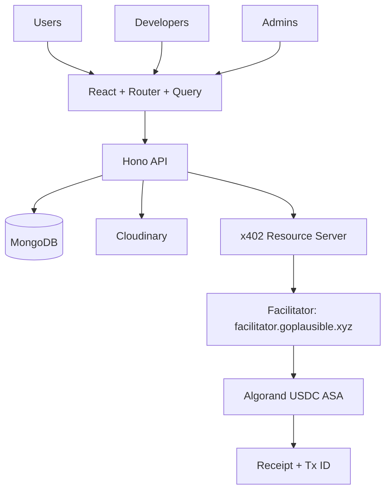
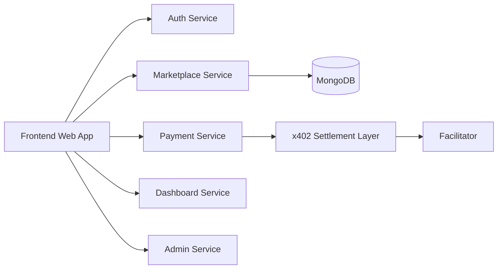
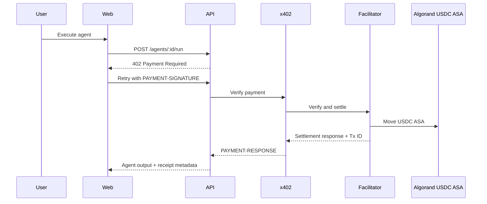
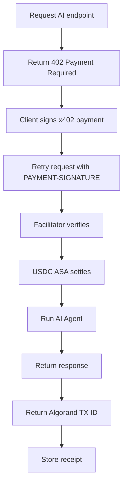
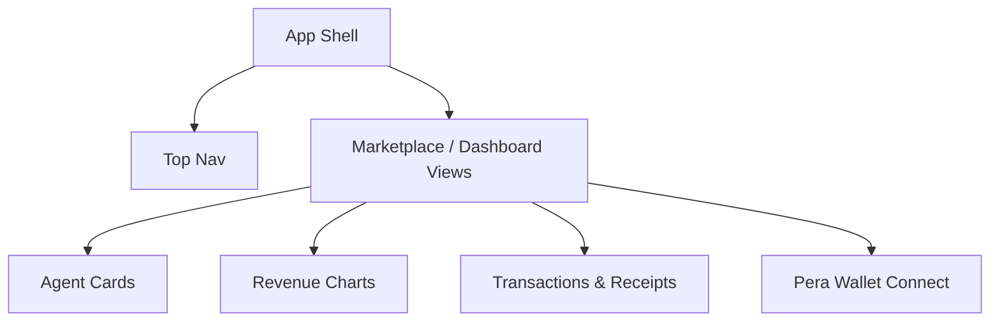
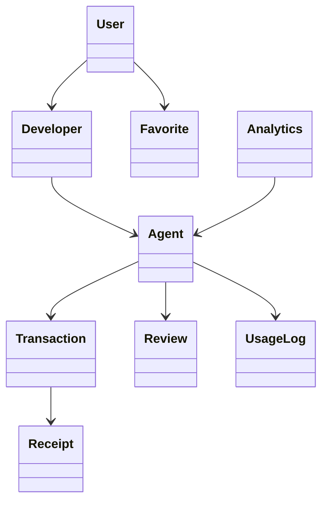
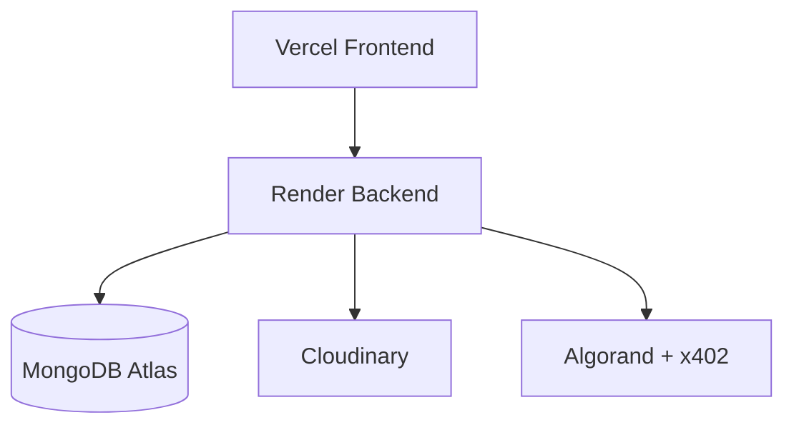

# Architecture

## High-Level Architecture

## Low-Level Architecture

- Presentation: React + TypeScript + TailwindCSS + React Router + React Query + Chart.js
- Application: Hono API with route modules, middleware, services, and x402 settlement hooks
- Domain: shared package with roles, schemas, constants, DTOs, and payment contracts
- Infrastructure: MongoDB, Cloudinary, Algorand x402 facilitator, Pera Wallet, JWT auth

## Microservice View

## Sequence Diagram

## Payment Flow Diagram

## Component Diagram

## Class Diagram

## Deployment Diagram

