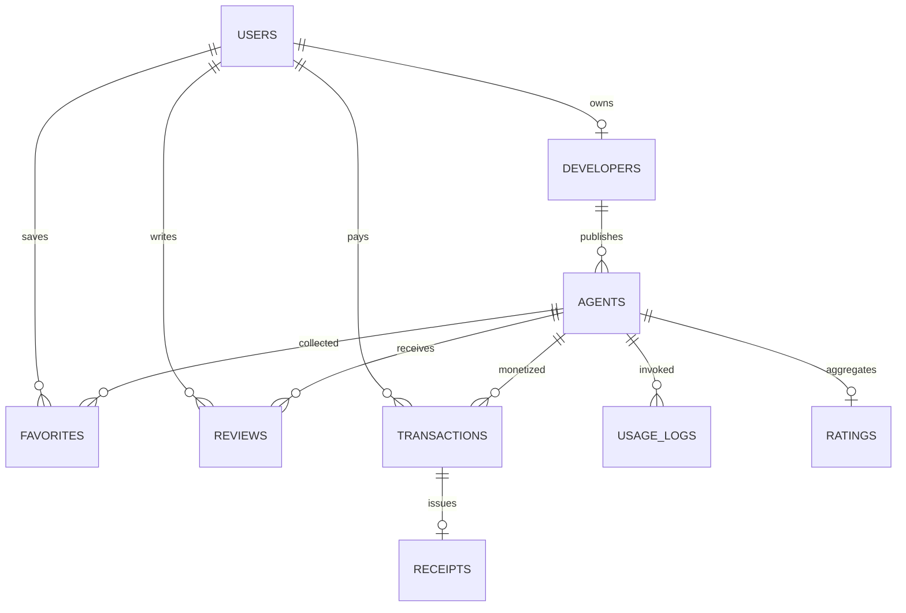

# Database

## MongoDB Collections

## Collections

- `users`: registration, roles, wallet verification, auth tokens
- `developers`: approval status, payout address, revenue, usage, ratings
- `agents`: listings, pricing, endpoint, documentation, versions, ratings
- `transactions`: x402 charge, settlement state, transaction ID, revenue split
- `receipts`: downloadable proof of payment and fulfillment
- `ratings`: aggregate rating summary per agent
- `reviews`: user comments and star ratings
- `favorites`: user saved agents
- `analytics`: platform, developer, and agent time-series metrics
- `usage_logs`: execution latency and run history
- `categories`: discovery taxonomy for browsing and filters

## Index Strategy

- Unique indexes on `users.email`, `users.walletAddress`, `agents.slug`
- Compound unique index on `favorites.userId + favorites.agentId`
- Compound unique index on `reviews.agentId + reviews.userId`
- Time-based index on `transactions.createdAt` and `usage_logs.createdAt`
- Reporting index on `analytics.scope + analytics.ownerId + analytics.date`

## Data Lifecycle

- Approved developers can publish agents and create versions.
- Every paid run creates a transaction and receipt.
- Ratings update the agent aggregate after review writes.
- Usage logs capture observability data for analytics and leaderboard features.
