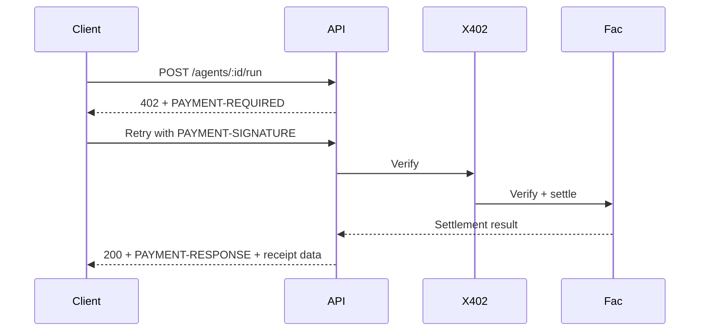

# API Design

## Public APIs

- `GET /health`
- `GET /agents`
- `GET /agents/:id`
- `POST /agents/:id/run`

## Authentication

- `POST /auth/register`
- `POST /auth/login`
- `POST /auth/refresh`
- `GET /auth/me`
- `POST /auth/connect-wallet`

## Marketplace and User APIs

- `POST /agents`
- `PUT /agents/:id`
- `DELETE /agents/:id`
- `POST /agents/:id/favorite`
- `DELETE /agents/:id/favorite`
- `POST /agents/:id/reviews`
- `GET /transactions`
- `GET /receipts`
- `GET /receipts/:id/download`

## Developer APIs

- `GET /developer/dashboard`
- `PUT /developer/agents/:id/pricing`
- `PUT /developer/agents/:id/documentation`
- `PUT /developer/agents/:id/endpoint`
- `PUT /developer/agents/:id/disable`
- `POST /developer/agents/:id/versions`

## Admin APIs

- `GET /admin/analytics`
- `GET /admin/users`
- `GET /admin/payments`
- `POST /admin/developers/:id/approve`
- `PUT /admin/categories`
- `DELETE /admin/agents/:id`

## Dashboard APIs

- `GET /dashboard`
- `GET /analytics`
- `GET /payments`

## Response Pattern

All endpoints return a shared envelope:

```json
{
  "success": true,
  "message": "...",
  "data": {}
}
```

## x402 Payment API Flow


