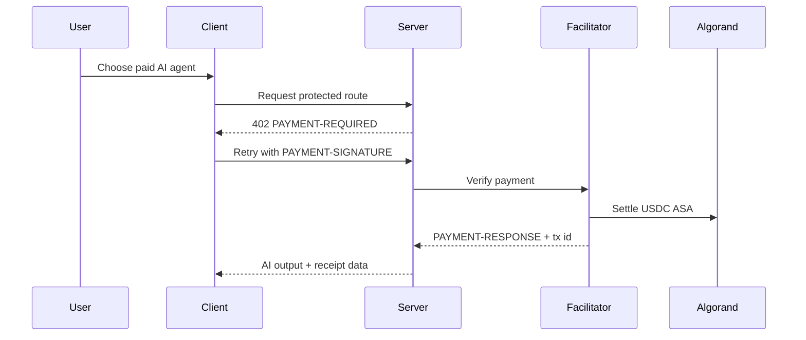

# Payment Layer

## x402 Implementation

AIHub uses the following x402 packages:

- `@x402/core/server`
- `@x402/hono`
- `@x402/fetch`
- `@x402/avm`

## Server Side

- The Hono API creates an x402 resource server.
- Protected agent-run routes are registered with the exact scheme.
- The facilitator URL is configured from environment variables.
- A settlement middleware captures `PAYMENT-RESPONSE` and writes a receipt after successful execution.

## Client Side

- The web app wraps `fetch` with x402 payment handling.
- Pera Wallet is used for Algorand signing intent.
- A retry request is automatically sent after the 402 challenge.

## Payment Flow

## Revenue Split

- User pays the listed price in USDC ASA.
- Marketplace receives 10%.
- Developer receives 90%.

## Verification and Receipts

- Every settled request stores a transaction document.
- Receipts are downloadable and linked to the Algorand transaction ID.
- Failed or cancelled settlements are marked in MongoDB for traceability.
