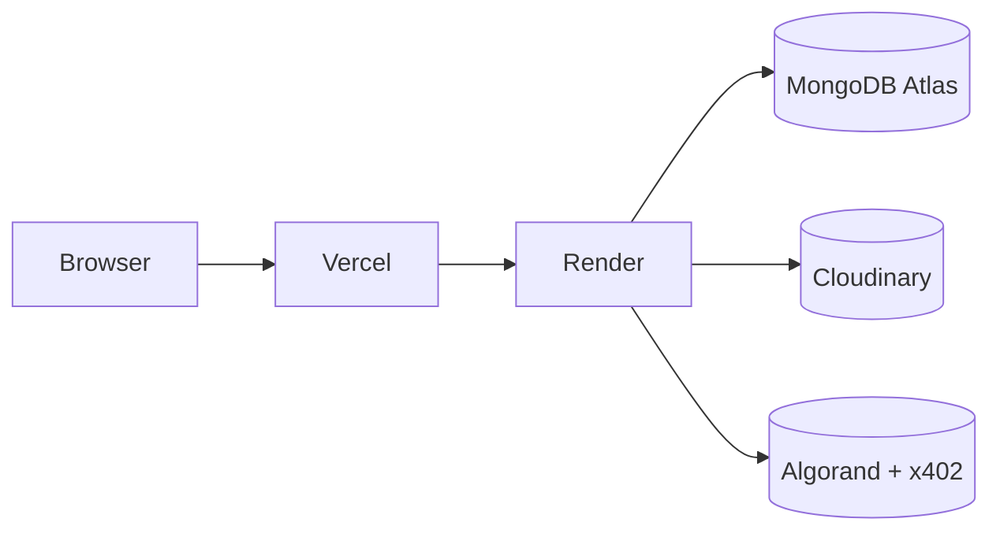

# Deployment

## Target Platforms

- Frontend: Vercel
- Backend: Render
- Database: MongoDB Atlas
- Storage: Cloudinary

## Environment Strategy

- Use `.env.example` as the deployment reference.
- Keep production secrets only in platform secret managers.
- Use separate Algorand testnet and mainnet configurations.

## Deployment Diagram

## Build Steps

1. Install workspace dependencies.
2. Build shared package first.
3. Build API and web applications.
4. Configure environment variables on Vercel and Render.
5. Verify x402 facilitator connectivity.
6. Validate payment flow on Algorand testnet before mainnet launch.

## Docker Notes

- The backend has a Dockerfile for local/container deployment.
- The frontend is deployed to Vercel and does not require a Docker image in this repo.

## Operational Notes

- Keep the API behind HTTPS.
- Set a stable `X402_PAY_TO` address.
- Pin the facilitator URL per environment.
- Use a managed MongoDB replica set for reliability.
