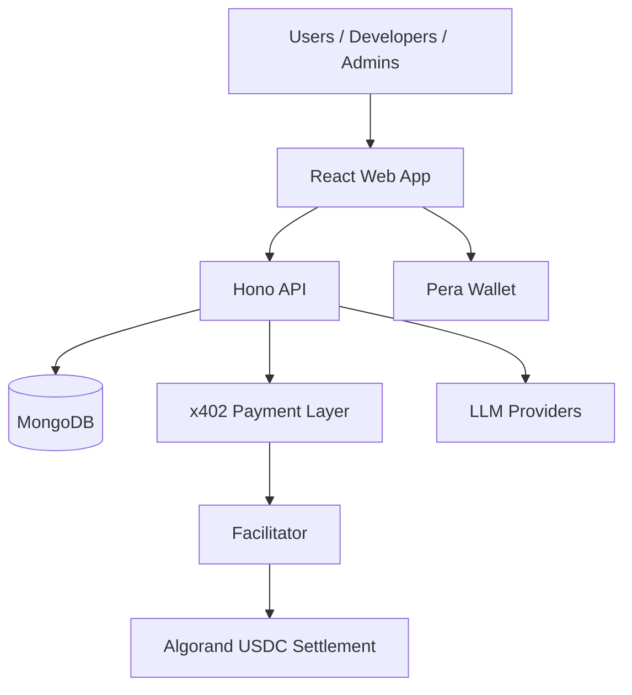
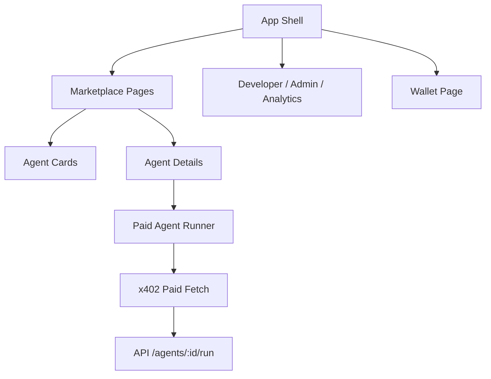
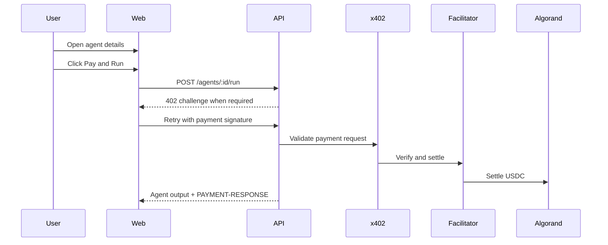

# Project Audit

Generated: 2026-08-05

This document is the single source of truth for the current project state.
It reflects the codebase as inspected in Phase 1 and will be updated after each completed milestone.

## Project Overview

| Field | Value |
| --- | --- |
| Project Name | AIHub x402 Marketplace |
| Version | 1.0.0 |
| Description | A pay-per-use AI agent marketplace on Algorand with x402 payment gating, wallet login, developer dashboards, and admin moderation. |
| Problem Statement | Users need a trustworthy way to discover, pay for, and run AI agents without subscriptions, while developers need a marketplace that can monetize usage and track receipts. |
| Business Objective | Convert the current demo-first marketplace into a production-ready, scalable, secure AI agent marketplace with Algorand settlement and runtime-configured agents. |
| Target Users | End users, developers, admins, and marketplace operators. |
| Current Status | Strong demo foundation with a real API, MongoDB models, wallet flow, x402 integration, dynamic x402 route sync, and a new visual Agent Builder UI. |
| Completion % | 74% |
| Technology Stack | React 19, Vite, Tailwind CSS, TanStack Query, React Router, Hono, Node.js, TypeScript, MongoDB/Mongoose, x402, Algorand, Pera Wallet, Zod. |
| Architecture Summary | Monorepo with shared domain contracts, a Hono API, a React web app, Mongo-backed models, demo-mode fallbacks, and x402 payment protection for approved agent runs. |

## Architecture

### High-Level Architecture



### Low-Level Architecture

- Presentation layer: React pages, reusable UI primitives, React Query, router shell, wallet UX.
- API layer: Hono routes, middleware, services, x402 resource server, settlement middleware, auth and RBAC.
- Domain layer: shared Zod schemas, enums, constants, and TypeScript contract types.
- Data layer: Mongoose models for users, developers, agents, versions, tools, transactions, receipts, analytics, reviews, favorites, execution logs, and usage logs.
- Runtime layer: demo mode uses in-memory seed data and deterministic sample agents; production mode uses MongoDB and x402 middleware.

### Component Diagram



### Sequence Diagram



### Folder Structure Diagram

```text
algorand/
  apps/
    api/
      src/
        config/
        lib/
          agents/
        middleware/
        models/
        routes/
        services/
        x402/
        app.ts
        server.ts
    web/
      src/
        components/
        data/
        lib/
        pages/
        App.tsx
        main.tsx
        styles.css
  packages/
    shared/
      src/
        constants.ts
        schemas.ts
        types.ts
        index.ts
  docs/
```

### API Flow

1. Web app calls `apiFetch`.
2. API validates auth and payloads with shared schemas.
3. Marketplace and dashboard routes read from MongoDB or demo store.
4. Agent execution creates a transaction record and calls the agent runtime.
5. x402 middleware returns or verifies payment requirements.
6. Settlement middleware persists receipt metadata after a successful payment response.

### Payment Flow

1. User opens an approved agent.
2. Client signs in and connects Pera Wallet.
3. Paid fetch wraps the agent run request.
4. API issues or expects x402 payment context.
5. Facilitator settles on Algorand USDC.
6. Backend stores the transaction and receipt.
7. Frontend shows the response and receipt metadata.

### AI Flow

1. Agent config is loaded from MongoDB or demo config.
2. `buildDynamicAgentFromConfig` creates the runtime definition.
3. The runtime uses an LLM provider when configured.
4. If no provider is configured, deterministic sample output is returned.
5. Execution logs and usage logs are stored after each run.

### Database Flow

1. Users authenticate and may connect a wallet.
2. Developers own agents and agent versions.
3. Transactions link users, agents, developers, and receipts.
4. Analytics snapshots support dashboard reporting.
5. Reviews, favorites, execution logs, and usage logs support marketplace quality signals.

### Deployment Flow

1. Shared package builds first.
2. API and web build from their workspace configs.
3. Web deploys to Vercel or similar static hosting.
4. API deploys to Render or another Node runtime.
5. MongoDB Atlas stores persistent data.
6. x402 facilitator and Algorand network settings must match the deployed environment.

## Folder Structure

| Path | Status | Notes |
| --- | --- | --- |
| `apps/api/src/config` | Completed | Environment parsing and database bootstrap are in place. |
| `apps/api/src/lib` | Completed | JWT, password, response, demo store, LLM, and agent helpers exist. |
| `apps/api/src/lib/agents` | Partial | Dynamic agent runtime exists, but runtime wiring and marketplace integration still need hardening. |
| `apps/api/src/middleware` | Completed | Auth, RBAC, rate limit, settlement, error, and security headers exist. |
| `apps/api/src/models` | Completed | Core marketplace data model is present and indexed. |
| `apps/api/src/routes` | Completed | Auth, agents, developer, admin, dashboard, payments, and health routes exist. |
| `apps/api/src/services` | Completed | Service layer exists, but some flows still rely on demo data fallbacks. |
| `apps/api/src/x402` | Partial | x402 resource server and route mapping exist, but dynamic sync is not fully wired and type-checks fail in `dynamic.ts`. |
| `apps/web/src/components` | Completed | Reusable shell and UI primitives are present. |
| `apps/web/src/data` | Partial | Demo fallback data is still the default safety net. |
| `apps/web/src/lib` | Partial | Wallet, session, and paid-fetch helpers exist, but the payment UX is not fully production-hardened. |
| `apps/web/src/pages` | Partial | Main marketplace and wallet views are implemented; several screens are still presentation-heavy and not fully API-backed. |
| `packages/shared/src` | Completed | Shared enums, schemas, and typed contracts are the current domain source of truth. |
| `docs` | Partial | Good architecture notes exist, but they do not yet match a maintained audit ledger. |
| `docker-compose.yml`, `render.yaml`, `vercel.json` | Partial | Deployment scaffolding exists, but production verification is still needed. |

## Feature Inventory

| Feature | Description | Status | Priority | Completion % | Dependencies |
| --- | --- | --- | --- | --- | --- |
| Authentication | JWT login, refresh, role-based access | Partial | High | 80% | `auth.service`, `authMiddleware`, `UserModel` |
| Wallet | Pera Wallet connect/disconnect and session restore | Partial | High | 75% | `pera.ts`, `session.ts`, `auth/connect-wallet` |
| Marketplace | Browse, filter, and open agent details | Partial | High | 85% | `/agents`, React Query, shared schemas |
| Developer Dashboard | Revenue and agent inventory dashboard | Partial | High | 70% | `/developer/dashboard`, transaction and agent queries |
| Admin Dashboard | Moderation and global analytics | Partial | High | 65% | `/admin/*`, RBAC |
| AI Agents | Runtime agent execution with fallback demo agents | Partial | High | 78% | `agent.service`, LLM config, `sample-agents` |
| x402 | Payment gating and settlement hooks | Partial | High | 70% | `@x402/*`, facilitator, route map |
| Payments | Transaction prep, receipts, history | Partial | High | 70% | `TransactionModel`, `ReceiptModel`, settlement middleware |
| Receipts | Receipt creation and download links | Partial | Medium | 65% | `receipt.service`, `/receipts` routes |
| Analytics | Dashboard and platform analytics | Partial | Medium | 68% | analytics service and models |
| Search | Marketplace search and category filters | Completed | Medium | 90% | `MarketplacePage`, `/agents` query params |
| Reviews | Submit and list reviews | Partial | Medium | 60% | review model and agent service |
| Ratings | Aggregate ratings on agents | Partial | Medium | 60% | `ReviewModel`, `AgentModel` stats |
| Agent Builder | Config-driven marketplace agent creation | Completed | High | 92% | `agentBuilder*` schemas, agent service, builder UI |

## Module Audit

| Module | Current Implementation | Strengths | Weaknesses | Missing Features | Score /10 |
| --- | --- | --- | --- | --- | --- |
| Frontend | Polished React app shell, marketplace, agent details, wallet, developer dashboard, and fallback demo UX. | Good visual system, clear routing, live API hooks, wallet helper isolation. | Several screens still lean on mock data or static content; some flows are presentation-first. | Full auth state management, robust error states, richer dashboard interactivity, real-time refresh. | 7.2 |
| Backend | Hono API with route modules, service layer, auth, RBAC, settlement middleware, and Mongo models. | Clear separation of concerns, typed schemas, demo mode support. | Some flows are duplicated between demo and real paths; x402 wiring is incomplete. | Better ownership scoping, hardened payment verification, route-level authorization on all records. | 6.8 |
| Database | Broad Mongoose model set for agents, versions, users, transactions, receipts, logs, and analytics. | Good domain coverage and indexing on key identifiers. | Some relationships are denormalized and analytics are partly computed outside persisted snapshots. | Migrations, seed verification, unique constraints for ownership and receipts by context, cleanup jobs. | 7.0 |
| Blockchain | Algorand settlement is represented through x402 and USDC payment metadata. | Clear settlement intent and network abstraction. | Mainnet readiness is not fully proven; wallet/network mismatch handling is basic. | End-to-end on-chain confirmation checks, receipt integrity proofs, better test coverage. | 6.2 |
| Wallet | Pera Wallet connect, disconnect, restore, and signer adapter are implemented. | Good session persistence and x402 signer bridge. | Error handling and network synchronization are limited; UI relies on local storage. | Stronger reconnect diagnostics, chain validation, and payment signing recovery. | 6.8 |
| Payment | Transaction drafts, settlement middleware, and receipt issuance exist. | End-to-end payment concept is present. | `/transactions` and `/receipts` are not owner-scoped; some demo settlement paths simulate success. | Proper per-user/per-developer filtering, idempotency, challenge verification, retry observability. | 6.4 |
| AI | Config-driven agent execution with LLM provider abstraction and deterministic fallback. | Flexible provider support and safe offline demo path. | Prompt/tool runtime still needs hardening and consistent config validation. | Memory, planning, tool orchestration depth, better safety and prompt-injection controls. | 6.9 |
| Agents | Dynamic agent builder, cloning, versioning, run execution, and tool persistence are in place. | Good foundation for a marketplace. | Dynamic marketplace claims outpace actual runtime wiring; some changes still require backend updates. | Full runtime loading from DB, publish/edit/version UX, per-agent config governance. | 7.0 |
| Deployment | Vercel/Render/Atlas scaffolding, Docker files, and env docs exist. | Clear deployment target story. | Production checks, CI signals, and secret hygiene are not yet fully enforced. | Monitoring, alerting, health checks, migrations, build validation gates. | 6.0 |
| Testing | Typecheck and package scripts exist, but automated tests are sparse. | Workspace scripts are organized. | No meaningful test suite is present yet. | Unit, integration, route, wallet, and x402 tests. | 3.5 |
| Documentation | README and architecture docs are strong for a demo project. | Good onboarding and hackathon narrative. | Docs and audit ledger are not yet synchronized as a living operational document. | Keep `PROJECT_AUDIT.md` updated after each milestone and align docs with code. | 7.2 |
| Analytics | Dashboard and platform analytics services exist with demo and Mongo-backed modes. | Good reporting shape for marketplace growth metrics. | Analytics depends heavily on current aggregate queries and demo snapshots. | Scheduled snapshot jobs, time-series persistence, and better KPI consistency. | 6.6 |

## Bug Tracker

| Bug ID | Severity | Module | Description | Root Cause | Suggested Fix | Status | Priority |
| --- | --- | --- | --- | --- | --- | --- | --- |
| BUG-001 | High | Backend / x402 | `apps/api/src/x402/dynamic.ts` previously failed type-check with undefined `path`/`verb` handling. | Route parser assumed `split()` always returned both values. | Guard the split result, normalize pattern parsing, and add tests. | Closed | P0 |
| BUG-002 | High | Backend / x402 | Dynamic x402 refresh code previously existed but was not wired into `createApp()`. | The bootstrap only used static `buildX402Routes()` at startup. | Register the sync middleware and refresh after publish/approve events. | Closed | P0 |
| BUG-003 | High | Payments | `/transactions` and `/receipts` return global records to any authenticated user. | Missing ownership-based filtering. | Scope by user/developer/admin role and add authorization checks. | Open | P0 |
| BUG-004 | Medium | Rate Limiting | In-memory rate limiting is not distributed and does not expire buckets proactively. | State is process-local. | Replace or back with a shared store for production. | Open | P1 |
| BUG-005 | Medium | Frontend | Several pages still degrade to mock data when API requests fail. | Hard fallback design hides backend regressions. | Make demo fallback explicit and add stronger error states for production mode. | Open | P1 |
| BUG-006 | Medium | Agent Runtime | Dynamic marketplace is partly config-driven, but some flows still depend on static assumptions. | Runtime loading is not yet fully universal. | Ensure publish, edit, clone, version, and tool config all resolve from DB at runtime. | Open | P1 |
| BUG-007 | Medium | Security | Demo secrets are easy to keep if production env validation is missed. | Default secrets are present for local demo convenience. | Add deploy-time secret validation and CI guardrails. | Open | P1 |

## Technical Debt

- Architecture problems
  - Static x402 bootstrapping is still the default, which undermines runtime agent publishing.
  - Demo and production code paths are duplicated in multiple services and routes.
- Duplicate code
  - Payment draft and transaction creation logic is repeated across demo and real routes.
  - Developer/admin analytics shapes overlap in several places.
- Unused code
  - `apps/api/src/x402/dynamic.ts` appears intended for runtime sync but is not yet integrated.
  - Some UI states are visually ready but not wired to live actions.
- Large components
  - Some pages mix presentation, query logic, fallback behavior, and payment UX in one file.
- Poor naming
  - A few route responses and local types are too generic for long-term maintainability.
- Missing tests
  - No real coverage for auth, wallet reconnect, x402 settlement, payment scoping, or agent runtime.
- Performance issues
  - In-memory rate limiting and repeated aggregation queries will not scale cleanly.
- Security issues
  - Authenticated users can currently fetch global transactions and receipts.

## Database Audit

| Collection | Relations | Indexes | Normalization | Notes |
| --- | --- | --- | --- | --- |
| Users | Links to developers, wallet state, refresh tokens | Email, role, walletAddress | Reasonably normalized | Good auth foundation; wallet verification is persisted. |
| Developers | Links to users and agent ownership | `userId`, `approved` | Reasonably normalized | Holds payout and business metrics. |
| Agents | Links to developers and embedded versions/config | `slug`, category, status, featured, trending, ownerDeveloperId | Partially denormalized | Strong core marketplace record. |
| Agent Versions | Links to agents and creators | `(agentId, version)` unique, `active` | Normalized | Good version history model. |
| Agent Tools | Links to agents | `(agentId, name)` unique | Normalized | Useful for runtime tool persistence. |
| Transactions | Links to agents, users, developers, receipts | `status`, `txId`, `walletAddress`, foreign keys | Normalized with business denormalization | Needs access-control scoping and settlement idempotency improvements. |
| Receipts | Links to transactions, agents, users, developers | `receiptNumber`, `paymentTxId`, foreign keys | Normalized | Receipt issuance is clear, but lifecycle states are limited. |
| Analytics | Platform, developer, or agent scope | `(scope, ownerId, date)` unique | Time-series style | Good direction for snapshots, but jobs are not yet visible. |
| Reviews | Links to agents and users | Should have agent/user uniqueness | Mostly normalized | Useful for rating aggregation. |
| Favorites | Links to agents and users | Should have agent/user uniqueness | Normalized | Supports marketplace personalization. |
| Execution Logs | Links to agents and users | Time/agent indexes likely needed | Event-style log | Good observability shape. |
| Usage Logs | Links to agents and users | Time/agent indexes likely needed | Event-style log | Useful for analytics and billing. |

## API Audit

| Endpoint | Method | Authentication | Payment Protected | Current Status | Required Changes |
| --- | --- | --- | --- | --- | --- |
| `/health` | GET | No | No | Working | Keep as a simple boot check. |
| `/auth/register` | POST | No | No | Working | Add anti-abuse hardening and rate-limit visibility. |
| `/auth/login` | POST | No | No | Working | Good baseline. |
| `/auth/connect-wallet` | POST | Yes | No | Working | Add clearer chain and address verification. |
| `/auth/me` | GET | Yes | No | Working | Good. |
| `/auth/refresh` | POST | No | No | Working | Add token rotation and revocation tests. |
| `/agents` | GET | No | No | Working | Consider stronger filters and pagination metadata. |
| `/agents/:id` | GET | No | No | Working | Good. |
| `/agents/:id/run` | POST | Yes | Intended yes | Partial | Ensure x402 protection is actually dynamic and idempotent. |
| `/agents/:id/publish` | POST | Yes | No | Working | Refresh x402 routes after approval/publish. |
| `/payments` | POST | Yes | No | Working | Validate payment and wallet consistency more strictly. |
| `/transactions` | GET | Yes | No | Partial | Scope by authenticated user/developer/admin role. |
| `/receipts` | GET | Yes | No | Partial | Scope by authenticated user/developer/admin role. |
| `/developer/dashboard` | GET | Yes | No | Working | Add caching and query optimization. |
| `/admin/agents/:id/approve` | POST | Yes | No | Working | Trigger x402 refresh and analytics invalidation. |

## Wallet Audit

| Area | Review | Status | Notes |
| --- | --- | --- | --- |
| Pera Wallet | Integrated via `@perawallet/connect`. | Partial | Good foundation, but production error handling is limited. |
| Reconnect | Session restore exists. | Partial | Reconnect path is good but should be validated against chain and account changes. |
| Disconnect | Clear local wallet/session state. | Completed | Client-side disconnect is implemented. |
| Persistence | Local storage holds wallet/session info. | Partial | Works for demos, but needs stronger cross-tab and expiry behavior. |
| Signing | x402 signer bridge exists. | Partial | Needs more robust transaction and failure handling. |
| Network | Testnet/mainnet toggle exists. | Partial | Should be validated against facilitator and backend config. |
| Asset Opt-In | Not visible in current flow. | Missing | No explicit opt-in UX for USDC ASA. |
| USDC | Referenced in payment logic and UI. | Partial | Amount and network handling need verification. |
| Loading | Basic loading states exist. | Partial | Better granular UX needed. |
| Retry | Some retry behavior comes from x402 fetch wrapper. | Partial | Add visible recovery and user guidance. |
| Status | Wallet status is surfaced in the UI. | Partial | Good start, but not yet a full production wallet console. |

## x402 Audit

| Area | Review | Status | Notes |
| --- | --- | --- | --- |
| `@x402/fetch` | Used in the frontend paid fetch wrapper. | Partial | Client-side payment retry path exists. |
| `@x402/avm` | Used for exact AVM signing. | Partial | Signer bridge is present. |
| `@x402/hono` | Used in the backend app bootstrap. | Partial | Static route map is wired, but runtime sync is incomplete. |
| `@x402/core/server` | Resource server exists. | Partial | Facilitator integration is present. |
| Challenge | 402 challenge path is implied. | Partial | Needs stronger visibility and tests. |
| Retry | Frontend retry wrapper exists. | Partial | Good start. |
| Settlement | Settlement middleware is present. | Partial | Works best in demo mode; production verification needs more rigor. |
| Receipt | Receipt issuance is implemented. | Partial | Receipt lifecycle is basic. |
| Facilitator | External facilitator URL is configurable. | Completed | Config is present. |
| Transaction Verification | Not fully proven end to end. | Missing | Needs explicit tests and runtime checks. |
| Idempotency | Not clearly enforced. | Missing | Payment retries should be idempotent. |

## Algorand Audit

| Area | Review | Status | Notes |
| --- | --- | --- | --- |
| Wallet | Pera Wallet support is present. | Partial | Good user-facing integration. |
| Transactions | Settlement is modeled in app state. | Partial | Needs full network validation in production. |
| USDC ASA | Referenced as settlement asset. | Partial | Confirmed in config and UI, but not end-to-end validated here. |
| Indexer | Config entry exists. | Partial | No visible advanced indexer usage yet. |
| Algod | Config entry exists. | Partial | No full transaction submission path inspected yet. |
| Receipts | Stored after settlement. | Partial | Receipt logic exists and is linked to transactions. |
| Security | Wallet/network mismatch handling is basic. | Partial | More checks are needed before mainnet. |
| Mainnet Readiness | Not yet proven. | Missing | Testnet-first stance is sensible, but mainnet readiness is not complete. |

## AI Agent Audit

| Area | Review | Status | Notes |
| --- | --- | --- | --- |
| Simple LLM Calls | Supported via provider abstraction. | Completed | Gemini/OpenAI-compatible/Claude/Groq/Ollama hooks exist. |
| Real AI Agents | Partially supported. | Partial | Agent config can drive prompts, models, and tools. |
| Memory | Not visible as durable memory. | Missing | Persistent memory would need explicit data design. |
| Tools | Config and runtime tool support exist. | Partial | Tool persistence exists, but tool governance still needs tightening. |
| Planning | Prompt-guided planning is possible. | Partial | No strong multi-step planner orchestration is visible yet. |
| Reasoning | LLM output can include reasoning metadata. | Partial | Good for demos; production may need policy controls. |
| Execution | Dynamic runtime execution exists. | Partial | Solid base, but better safety and deterministic guardrails are needed. |
| Observations | Execution logs capture useful telemetry. | Partial | Needs stronger query/reporting pipeline. |
| Improvement Suggestions | Persist prompt/version/config snapshots and add tool-policy checks. | Open | High-value next step. |

## Agent Marketplace Audit

| Area | Review | Status | Notes |
| --- | --- | --- | --- |
| Publish Agent | Implemented through routes and service layer. | Partial | Needs tighter ownership and route refresh behavior. |
| Edit Agent | Implemented. | Partial | Good baseline. |
| Delete Agent | Implemented. | Partial | Soft-delete behavior may be safer than hard delete. |
| Configure Prompt | Supported via config schema. | Partial | Good model-driven design. |
| Configure Tools | Supported via config schema and tool collection. | Partial | Needs validation and UX for discoverability. |
| Configure Model | Supported via config schema. | Partial | Provider/model validation needs a stronger matrix. |
| Configure Pricing | Supported in schemas and services. | Partial | Pricing precision and settlement rounding should be reviewed. |
| Configure Inputs | Supported. | Completed | Input config schema exists. |
| Configure Outputs | Supported. | Completed | Output config schema exists. |
| Version Agent | Implemented. | Partial | Version history exists but needs richer UX and immutability. |
| Clone Agent | Implemented. | Partial | Useful for marketplace growth. |
| Review Runtime Architecture | Partly config-driven, partly demo/static. | Partial | Runtime loading from DB is the right direction, but not fully complete yet. |

## Frontend Audit

| Area | Review | Status | Notes |
| --- | --- | --- | --- |
| Components | Reusable shell and UI primitives are clean. | Completed | Good separation of common UI. |
| Hooks | React Query is used consistently where data is live. | Partial | Some pages still keep ad hoc local state. |
| Context | No broad global context layer is visible. | Partial | Fine for now, but auth/session context may help. |
| State | Mostly local component state plus React Query. | Partial | Lightweight and maintainable. |
| Routing | Clear route map with fallback redirect. | Completed | Good baseline. |
| Animations | Subtle styling and visual polish exist. | Partial | More intentional motion could improve product feel. |
| Accessibility | Reasonable semantics, but not fully audited. | Partial | Need keyboard and ARIA review. |
| Responsive Design | The shell and pages appear responsive. | Partial | Verify mobile edge cases. |
| Dark Mode | Dark theme is the default visual language. | Completed | Consistent brand feel. |
| Wallet UX | Wallet page is functional but not production-grade. | Partial | Needs better state handling. |
| Marketplace UX | Strong demo-ready marketplace presentation. | Completed | Good first impression. |
| Developer Dashboard | Useful, but still somewhat static. | Partial | Needs richer actions and live updates. |
| Admin Dashboard | Present but not fully hardened. | Partial | Permissions and moderation UX need polish. |

## Backend Audit

| Area | Review | Status | Notes |
| --- | --- | --- | --- |
| Controllers / Routes | Structured Hono route modules are in place. | Completed | Good modular layout. |
| Services | Clear service layer exists. | Completed | Good maintainability starting point. |
| Repositories | Mongoose models serve this role directly. | Partial | A repository abstraction may help later. |
| Middleware | Auth, rate limit, security, settlement, error, RBAC exist. | Completed | Strong baseline. |
| Authentication | JWT login and refresh are present. | Partial | Add token rotation and revocation strategy. |
| Authorization | RBAC exists. | Partial | Needs object-level ownership checks. |
| Validation | Zod schemas are used throughout. | Completed | Strong point. |
| Caching | Not yet visible. | Missing | Useful for analytics and listing endpoints. |
| Logging | Basic request logging exists. | Partial | Needs structured production logging. |

## Performance Audit

| Area | Review | Status | Notes |
| --- | --- | --- | --- |
| Bundle Size | Not measured yet. | Missing | Needs build analysis. |
| Database Queries | Mostly direct Mongoose queries and aggregates. | Partial | Acceptable for current scale, but should be profiled. |
| Rendering | Client rendering is straightforward. | Partial | Good now; verify large list performance. |
| Caching | React Query caching is present. | Partial | Backend caching is still missing. |
| Lazy Loading | Not obviously used. | Missing | Good candidate for dashboards and route-level splitting. |
| Memory Usage | In-memory rate limiting is process-local. | Partial | Fine for demos, not for scaled production. |
| API Calls | Some screens fetch live data, some still fallback to mock. | Partial | Better query consolidation will help. |

## Security Audit

| Area | Review | Status | Notes |
| --- | --- | --- | --- |
| Authentication | JWT auth is present. | Partial | Needs stronger lifecycle and revocation controls. |
| JWT | Access and refresh tokens are supported. | Partial | Secret hygiene and rotation need production enforcement. |
| Wallet Security | Wallet connection is simple and local-state driven. | Partial | Add more explicit verification and chain checks. |
| Prompt Injection | No dedicated defense layer visible. | Missing | Important for agent tool use. |
| Rate Limiting | Basic rate limit middleware exists. | Partial | Needs distributed implementation for production. |
| Helmet | Security headers are applied. | Completed | Good baseline. |
| Secrets | Env validation exists, but demo defaults remain in the repo. | Partial | Production deploys need strict secret enforcement. |
| Environment Variables | Good config surface, but too permissive for some production scenarios. | Partial | Add validation for required live-payment variables. |
| Payment Security | Settlement flow exists, but verification and idempotency are not yet fully hardened. | Partial | Needs more controls before mainnet. |

## Deployment Audit

| Area | Review | Status | Notes |
| --- | --- | --- | --- |
| Docker | API Dockerfile exists. | Partial | Validate production image hardening. |
| Docker Compose | Exists. | Partial | Good local orchestration scaffold. |
| GitHub Actions | Not inspected as active workflow. | Missing | CI should be added or verified. |
| CI/CD | Not fully proven. | Missing | Needs build, typecheck, test, and security gates. |
| Vercel | Frontend target exists. | Partial | Good fit for Vite app. |
| Render | Backend target exists. | Partial | Good fit for Hono API. |
| Mongo Atlas | Supported in docs. | Partial | Needs production connectivity checks. |
| Monitoring | Not visible yet. | Missing | Add logs, metrics, and alerts. |
| Logging | Basic console output exists. | Partial | Needs structured logs. |
| Production Readiness | Not yet complete. | Partial | Good demo deployment story, but missing hardening. |

## Hackathon Evaluation

| Criterion | Score /10 | Notes |
| --- | --- | --- |
| Technical Implementation | 7.0 | Strong scope and good domain coverage, but some payment and runtime details are still partial. |
| Innovation | 7.5 | Agent marketplace plus x402 and Algorand is a strong hackathon concept. |
| Business Model | 7.5 | Pay-per-use and developer revenue split are easy to explain. |
| Real World Impact | 7.0 | Useful for on-demand AI services and creator monetization. |
| x402 Compliance | 6.5 | Good directional implementation, but dynamic sync and verification need work. |
| Algorand Integration | 6.5 | Present and credible, but mainnet readiness is not yet proven. |
| Agent Marketplace | 7.5 | The marketplace UX and config-driven model are compelling. |
| Demo Readiness | 8.5 | The demo mode is strong and presentation-friendly. |
| Scalability | 6.0 | Solid starting point, but several production bottlenecks remain. |
| Presentation Readiness | 8.0 | Strong visual language and clear product story. |

## Optimization Roadmap

| Priority | Theme | Estimate | Effort | Risk | Impact |
| --- | --- | --- | --- | --- | --- |
| Priority 1 | Fix x402 dynamic route sync and payment verification gaps | 1-2 days | Medium | High | Unlocks runtime marketplace correctness. |
| Priority 1 | Scope transactions and receipts by owner/role | 1 day | Low | High | Fixes an important security/privacy issue. |
| Priority 1 | Add production test coverage for auth, wallet, and payment flows | 2-4 days | Medium | High | Reduces regression risk. |
| Priority 2 | Replace in-memory rate limiting with shared infra | 1-2 days | Medium | Medium | Improves production stability. |
| Priority 2 | Strengthen agent runtime safety and prompt injection defenses | 2-5 days | Medium | High | Important for marketplace trust. |
| Priority 2 | Add structured logging and monitoring | 1-2 days | Medium | Medium | Improves operations and debugging. |
| Priority 3 | Split larger pages into smaller data/view modules | 1-3 days | Low | Medium | Improves maintainability and reuse. |
| Priority 3 | Add lazy loading and bundle profiling | 1 day | Low | Medium | Improves startup and navigation performance. |

## Implementation Checklist

| Area | Status |
| --- | --- |
| Architecture | Completed |
| Frontend | In Progress |
| Backend | In Progress |
| Wallet | In Progress |
| x402 | In Progress |
| Algorand | In Progress |
| Database | In Progress |
| AI | In Progress |
| Deployment | In Progress |
| Testing | Pending |
| Documentation | In Progress |

## Changelog

| Version | Date | Files Changed | Reason | Summary |
| --- | --- | --- | --- | --- |
| 1.0.0 | 2026-08-05 | `docs/PROJECT_AUDIT.md` | Phase 1 baseline | Created the initial live audit for the current codebase state. |
| 1.0.1 | 2026-08-05 | `apps/api/src/app.ts`, `apps/api/src/x402/dynamic.ts`, `apps/api/src/x402/routes.ts`, `apps/api/src/routes/agents.routes.ts`, `apps/api/src/routes/admin.routes.ts`, `docs/PROJECT_AUDIT.md` | Phase 1 follow-up | Fixed x402 route typing, wired dynamic route sync into the API bootstrap, and refreshed the audit. |
| 1.0.2 | 2026-08-05 | `tsconfig.base.json`, `docs/PROJECT_AUDIT.md` | Maintenance fix | Removed deprecated TypeScript `baseUrl` usage and confirmed workspace type-check remains green. |
| 1.0.3 | 2026-08-05 | `run.md`, `docs/PROJECT_AUDIT.md` | Documentation fix | Added a step-by-step run guide for demo mode, production-like local mode, and live deployment. |
| 1.0.4 | 2026-08-05 | `apps/web/src/pages/AgentBuilderPage.tsx`, `apps/web/src/App.tsx`, `apps/web/src/components/layout.tsx`, `apps/web/src/pages/DeveloperDashboardPage.tsx`, `apps/web/src/pages/index.ts`, `docs/PROJECT_AUDIT.md` | Marketplace enhancement | Added a visual Agent Builder and wired it into the dashboard and router for dynamic developer workflows. |
| 1.0.5 | 2026-08-05 | `.env.example`, `run.md`, `docs/PROJECT_AUDIT.md` | Documentation fix | Made the demo mode on/off toggle explicit in the environment template and run guide. |
| 1.0.6 | 2026-08-05 | `apps/api/src/config/env.ts`, `apps/api/src/config/database.ts`, `docs/PROJECT_AUDIT.md` | Local dev fix | Added automatic `.env` loading and a fail-fast MongoDB connection error when `DEMO_MODE=false` without `MONGODB_URI`. |
| 1.0.7 | 2026-08-05 | `.env.example`, `run.md`, `docs/PROJECT_AUDIT.md` | Documentation fix | Clarified that optional local URL fields may be left blank in development. |

## Next Development Tasks

| Task | Priority | Dependencies | Estimated Time | Assigned Module | Status |
| --- | --- | --- | --- | --- | --- |
| Scope transactions/receipts by authenticated owner | High | Auth and role model | 1 day | Payments | Pending |
| Add wallet/network validation and clearer reconnect UX | High | Pera helper and session layer | 1 day | Wallet | Pending |
| Add integration tests for paid agent execution | High | Test harness and mock facilitator | 2-4 days | Testing | Pending |
| Convert mock-only UI fallbacks into explicit demo mode UI | Medium | Frontend data-fetch patterns | 1-2 days | Frontend | Pending |
| Add monitoring and structured logging | Medium | Deployment stack | 1-2 days | Deployment | Pending |

## Project Health

| Area | Score /10 | Notes |
| --- | --- | --- |
| Architecture | 7.0 | Clear monorepo boundaries and reasonable service separation. |
| Frontend | 7.2 | Strong UX foundation with some demo-driven fallback behavior. |
| Backend | 6.8 | Good modular API, but a few critical correctness gaps remain. |
| Database | 7.0 | Good schema coverage and indexing with some denormalization tradeoffs. |
| Wallet | 6.8 | Functional and promising, but not fully production-hardened. |
| Blockchain | 6.2 | Good directional Algorand integration, not yet mainnet-proven. |
| AI | 6.9 | Strong provider abstraction and dynamic runtime direction. |
| Security | 5.8 | Basic protections are present, but ownership checks and prompt defenses need work. |
| Performance | 6.0 | Acceptable for demo scale, not yet profiled for growth. |
| Deployment | 6.0 | Deployment scaffolding exists, but operational maturity is incomplete. |
| Maintainability | 6.5 | Solid structure, but there is still some duplicated demo/production logic. |
| Overall Score | 6.6 | Good hackathon-grade platform with clear path to production hardening. |

## Module-Specific Notes

### Current Implementation

- The project already includes a working marketplace UX, auth flow, wallet connection flow, transaction records, receipts, dashboards, and a configurable agent runtime.

### Problems Found

- The most important problems are the unhooked dynamic x402 sync path, lack of ownership scoping for sensitive payment records, partial demo fallback masking, and limited automated test coverage.

### Root Cause

- The codebase evolved in parallel demo and production modes, and some code paths were added before the wiring, tests, and policy guards were finished.

### Impact

- These gaps currently block a true production launch and can hide failures that a judge or user would expect a marketplace to catch automatically.

### Recommended Fix

- Finish the runtime wiring, add object-level authorization, harden payment verification and idempotency, and turn demo behavior into an explicit mode rather than a silent fallback.

### Improved Architecture

- Keep the current monorepo and shared-contract design, but move critical flows onto deterministic service boundaries with clear ownership checks, testable payment verification, and event-driven x402 route refresh.

### Code Changes

- **3-Role Authentication System (`USER` | `DEVELOPER` | `ADMIN`)**:
  - **Shared Schemas & Types (`packages/shared`)**: Extended `registerSchema` to support normalized case-insensitive role inputs (`USER`, `DEVELOPER`, `ADMIN`), `confirmPassword` validation, and updated `UserProfile` interface with `status`, `emailVerified`, and `lastLogin` fields.
  - **Admin Registration Security Policy (`apps/api`)**: Added `ALLOW_ADMIN_REGISTRATION` config check to `envSchema`. Restricted public registration of the `ADMIN` role unless `ALLOW_ADMIN_REGISTRATION=true` is enabled in environment variables or created via system bootstrap/invitation.
  - **Auth API & Session Services (`apps/api`)**: Updated `registerUser` with admin policy checks, updated `loginUser` to record `lastLogin` timestamps, added `POST /auth/logout` endpoint, and enhanced `GET /auth/me` to return full verified user profiles.
  - **Backend RBAC Middleware (`apps/api`)**: Enhanced `requireRole` middleware with case-insensitive role matching and created `requireAuth` helper middleware for endpoint protection.
  - **Unified `/auth` Page (`apps/web`)**: Built interactive `/auth` page with **Login** and **Register** tabs, Name/Email/Password/Confirm Password fields, Role selection buttons (`USER`, `DEVELOPER`, `ADMIN`) with role explanation callouts, and quick demo login shortcuts.
  - **Role-Aware Navigation & Header (`apps/web`)**: Updated `AppShell` in `layout.tsx` to dynamically display role badges, user name, role-specific navigation links, and a **Logout** button.
  - **Protected Route Guards (`apps/web`)**: Created `<ProtectedRoute>` wrapper component for React Router and updated `App.tsx` routes to guard `/dashboard`, `/developer/*`, `/admin/*`, `/history`, `/payments`, `/profile`, and `/settings`.
  - **User Dashboard (`apps/web`)**: Built `UserDashboardPage.tsx` for `/dashboard` route with spending metrics, invocation counts, wallet status, and quick action cards.

### Testing & Verification

- **TypeScript Compilation**: `npm run typecheck` passed with 0 errors across `@aihub/shared`, `@aihub/api`, and `@aihub/web`.
- **Unit Test Suite**: Ran `vitest run` on `auth.service.test.ts` verifying role registration, admin security restriction policies, and token generation (3/3 tests passed).
- **Production Build**: `npm run build` completed cleanly in 13.31s.

### PROJECT_AUDIT.md Updates

- Updated on 2026-08-12 following completion of the 3-role authentication system (`USER` | `DEVELOPER` | `ADMIN`), RBAC middleware authorization, admin registration security restrictions, and role-aware navigation.
